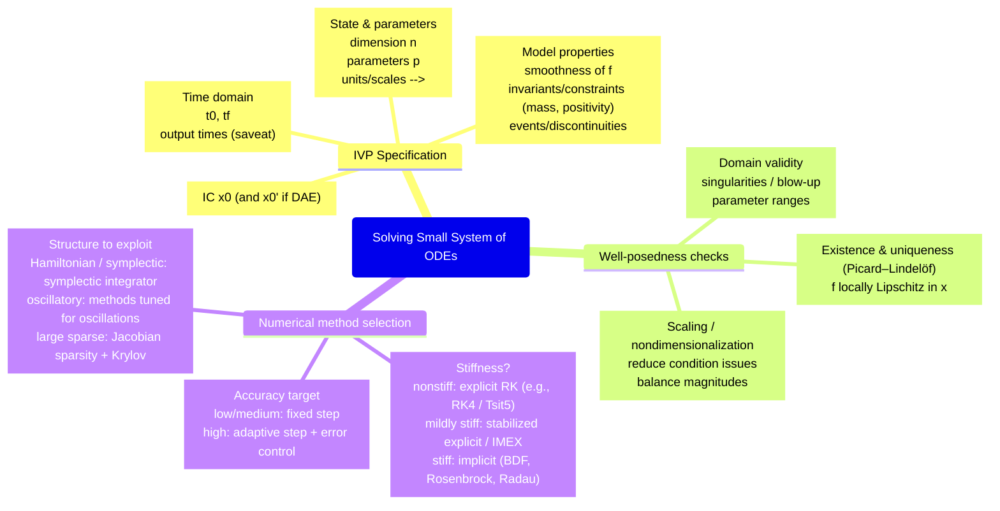
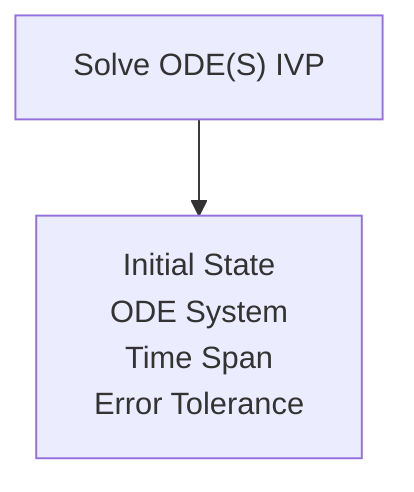

    \newlines["`Discretization details
      Step size / tolerance
        dt (fixed) OR reltol/abstol (adaptive)
        maxiters, dtmin/dtmax
      Error estimation
        embedded pair
        local truncation error
      Jacobian handling (implicit)
        analytic vs AD vs finite diff
        factorization / preconditioner
    `"]   
    \newlines["`Implementation pipeline
      Define f(t,x,p)
        allocate-free / in-place
        type stability
      Choose solver + options
        saveat / dense output
        callbacks (events)
      Run solve
        check return code
    `"]   
    \newlines["`Validation & verification
      Sanity checks
        conservation / invariants
        positivity / bounds
      Convergence
        refine dt or tighten tolerances
        compare against reference solution
      Sensitivity
        vary parameters p
        check qualitative stability
    `"]   
    \newlines["`Diagnostics & reporting
      Plots
        components vs t
        phase portraits
        norms / energy
      Performance
        allocations / profiling
        stiffness indicators
      Reproducibility
        fixed seeds (if noise)
        record solver/tols/version
    `"]   

