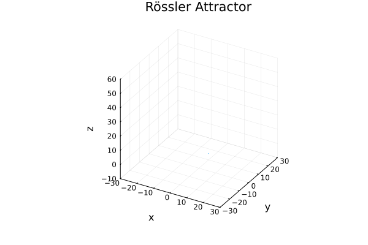
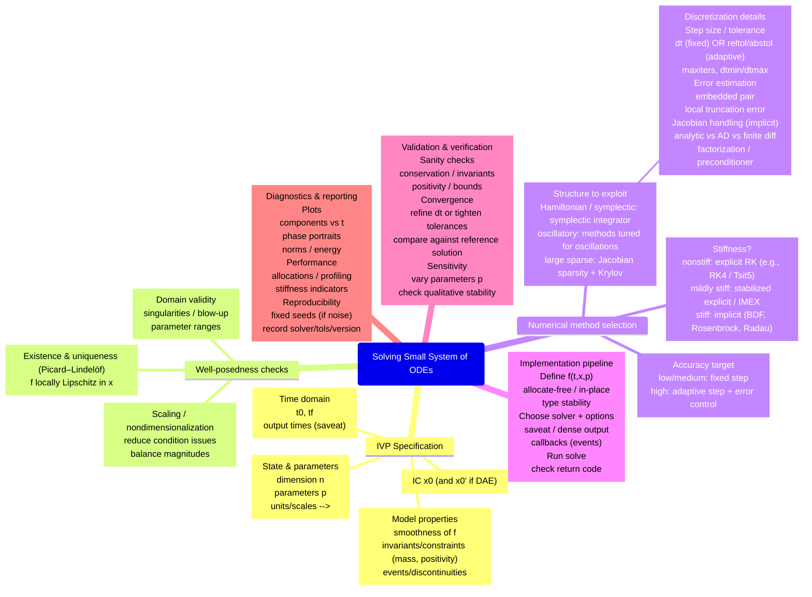
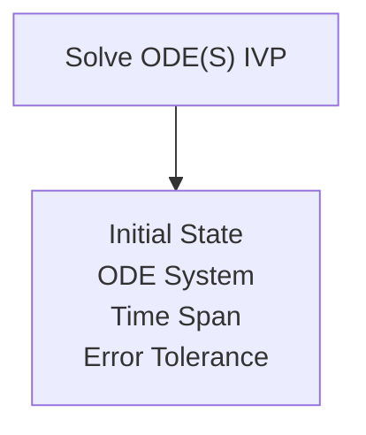

Benchmarks are compared via result object:

## Benchmark matrix (what variants you will compare)
C variants (same algorithm, different compilation / data layout)
  - C1: baseline: -O3 (no fast-math)
  - C2: fast-math: -O3 -ffast-math
  - C3: aggressive (optional): -Ofast -march=native (often implies fast-math; document it explicitly)

Implementation choices inside C:
  - State layout: double y[3] (stack) vs struct {double x,y,z;} (optional)
  - Use static inline RHS + restrict pointers to help optimization

Julia variants (match your poster narrative)
  - J1: naïve out-of-place Vector RHS (allocates each call)
  - J2: in-place Vector RHS (no per-call alloc)
  - J3: StaticArrays SVector RHS (stack/register-friendly)
  - J4: each of the above with @fastmath (separate benchmarks)
  - (Optional) J5: “production grade” version: @inbounds, @inline, - - preallocated temporaries, no globals

Important: Use a Julia-written RK4 loop for apples-to-apples with C or with python. (Comparing to DifferentialEquations.jl is valuable, but that’s a separate experiment because the algorithm differs unless you force fixed-step RK4.)


## Julia Implementations
  1. out-of-place
  2. in-place
  3. static
  4. annotated to support AD
  7. @inbounds and @inline


```json
{
  "lang":"C",
  "variant":"O3_ffast-math",
  "scenario":"final_state",
  "steps":20000,
  "time_ns_median":123456789,
  "ns_per_step":6172.8,
  "notes":"clang-17, -march=native"
}
```






```mermaid
flowchart LR
  %% ------------------------------------------------------------
  %% ODE Pipeline (Model → Implement → Solve → Analyze → Deliver)
  %% ------------------------------------------------------------

  
```
