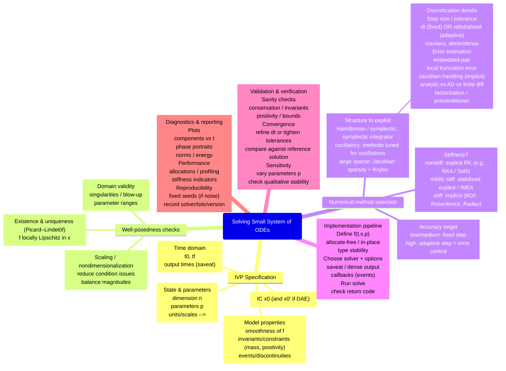

 

# TODO.md

## Goal
Finish the poster with a single clear narrative: **small, production-grade code changes produce measurable ODE performance improvements in SciML** (Rössler as the case study), supported by a **reproducible benchmark + figure pipeline** and **clean, readable visuals**.

---

## 0) Resolve headline metric + claim consistency (blocker)
Your current poster text claims a “tenfold speedup,” but the current Midpoint fixed-step results you’ve been working with (as reflected in your table/fig placeholders) do **not** obviously support 10× solve-time speedup. Decide which metric is headline and make the claim match computed numbers everywhere.

## 1) Lock scope and narrative (do first)
- [x] Intro to Rössler; then illustrate out-of-place vs in-place updating in pass-by-reference language.
- [x] Add 2–3 poster-distance bullets explaining stack allocation (`StaticArrays`) and why allocations matter (GC pressure / throughput).
- [x] Add 2–3 poster-distance bullets explaining `@inbounds` / `@inline` as “remove bounds checks / encourage inlining,” and why that can matter in tight loops.
  - Keep it factual; avoid over-claiming compiler behavior.
- [x] Confirmed: **performance ladder variants are already implemented in code** (benchmark driver constructs 8 variants).
- [x] Choose which **6–8 variants** you will actually show on the poster (recommend 6 for clarity):
  - Suggested core ladder (6):
    1) `rossler_naive` (allocating)
    2) `rossler` (allocating + `@inbounds/@inline`)
    3) `rossler_naive!` (in-place “plain”)
    4) `rossler!` (in-place + `@inbounds/@inline`)
    5) `rossler_static_naive` (static “plain”)
    6) `rossler_static` (static + `@inbounds/@inline`)
  - Optional add-ons (only if they strengthen the story without clutter):
    - `rossler_type_stable`
    - `rossler_ad`
- [x] Define baseline and speedup formula (single choice, used everywhere):
  - Baseline: `rossler_naive`
  - Speedup: `median_time(baseline) / median_time(variant)`

**Acceptance criteria**
- Variant names in the poster match repository function names (no drift, no renaming).
- The narrative ladder is visible directly in the figures/table (same ordering).

---

## 2) Make the numerical experiment authoritative (single source of truth)
- [ ] Ensure the benchmark driver produces consistent results for:
  - RHS timing
  - Solve timing
  - allocations/bytes
- [ ] Ensure the experiment uses consistent settings and that `poster.tex` matches them exactly:
  - fixed-step: `tspan`, `dt`, solver (RK4), output disabling policy
  - (Avoid adaptive tolerances unless you explicitly add an adaptive experiment panel)
- [ ] Document benchmark policy in one place (script header or poster “Experiment Spec” box):
  - warmup policy
  - `BenchmarkTools` configuration
  - whether output is disabled (e.g., `save_on=false`, `dense=false`, etc.)
- [ ] Make the parameter story consistent in text:
  - “canonical parameters” used for the attractor visualization vs. the benchmark parameters (currently these differ in `poster.tex`)

**Acceptance criteria**
- Running the benchmark script twice yields stable median ordering (minor variance acceptable).
- Captions state: metric, baseline, units, solver spec, and output policy.

---

## 2.Stretch) Add `C` and `Python` apples-to-apples RK4 fixed comparisons
Only do this if it does not jeopardize the poster completion. Treat as optional appendix / “next step” unless already nearly done.

- [ ] Define apples-to-apples rules:
  - Same RK4 algorithm
  - Same dt, tspan, initial condition, parameters
  - Same output policy (prefer no saving / minimal saving)
- [ ] C variants (same algorithm, different compilation / flags):
  - C1: `-O3` (no fast-math)
  - C2: `-O3 -ffast-math`
  - C3: optional: `-Ofast -march=native` (document implied fast-math)
- [ ] C implementation choices:
  - `double y[3]` (stack) vs `struct` layout (optional)
  - `static inline` RHS + `restrict` pointers
- [ ] Julia variants to match poster ladder:
  - J1: naïve out-of-place Vector RHS (allocates each call)
  - J2: in-place Vector RHS (no per-call alloc)
  - J3: StaticArrays SVector RHS (stack/register-friendly)
  - J4: each above with `@fastmath` (separate benchmarks; label clearly)
- [ ] Use a Julia-written RK4 loop for apples-to-apples with C/Python.
  - (Comparing to `DifferentialEquations.jl` is valuable but is a *separate* experiment unless algorithm is identical.)

**Acceptance criteria**
- All implementations run the same spec and report comparable metrics.

---

## 3) Build a one-command figure pipeline (`./poster/figures/`)
Create/finish:
- `poster/make_poster_figures.jl`

This script must:
- [ ] Run the canonical study entry point (e.g., `run_studies()` or a single-case runner).
- [ ] Flatten results into one DataFrame:
  - columns: `solver`, `variant`, `metric`, `median_time_ns`, `median_time_s`, `memory`, `allocs`
- [ ] Write all poster assets to: `./poster/figures/`
- [ ] Produce **exactly the figures referenced by `poster.tex`** (no extra, no missing).

### Minimum figure set (updated to match your current poster intent)
- [ ] **Figure A — Solve-time speedup (log scale)**
  - Currently referenced as: `rk4_time_normalized_log10.png`
  - Keep speedup definition consistent with captions.
- [ ] **Figure B — Solve-time bar chart (normalized)**
  - Create a second, distinct asset (do not reuse the same file twice).
  - Update `poster.tex` to reference the new filename.
- [ ] **Figure C — RHS + allocations**
  - RHS median time + allocations/bytes per RHS call (combined or two panels).
- [ ] **Figure D — Attractor / solution sanity check**
  - Use this to satisfy the “Add Figure: Rössler attractor” placeholder in the Introduction.
- [ ] Generate LaTeX table from data (avoid drift):
  - `./poster/figures/rk4_table.tex` (or a naming scheme you standardize)

**Acceptance criteria**
- One command regenerates all assets:
  - `julia --project -e 'include("poster/make_poster_figures.jl")'`
- `poster.tex` compiles without manual figure/table edits.
- `poster.tex` uses `\input{./figures/<table>.tex}` rather than a hand-typed table.

## 6) Content polish: make claims consistent and readable at poster distance
- [ ] Replace placeholders (“XX-fold speedup”) with computed values.
- [ ] Captions must specify:
  - what is measured (solve vs RHS),
  - baseline,
  - units,
  - output policy (saving disabled / saveat behavior),
  - solver spec (Midpoint fixed dt, RK4 fixed dt, etc.)
- [ ] Trim prose density:
  - 3–5 bullets per section max
  - prioritize numeric results and what they imply

**Acceptance criteria**
- A reader at ~1–2 meters can follow the story without reading everything.

---

## 7) Write a “production checklist” conclusion (right column)
Your current conclusion veers into symbolic computation / ModelingToolkit. Unless you add results supporting that, keep it as “next steps” only.

- [ ] Replace conclusion with a field-guide checklist:
  - 3 key takeaways (allocations, type stability, data layout/macros)
- [ ] Add reproducibility block:
  - repo path
  - commands to generate figures
  - command to build poster
- [ ] Limits / next steps (1–2 bullets):
  - larger systems
  - ensemble runs
  - stiff vs nonstiff
  - AD/Jacobian pipeline
  - (Optional) ModelingToolkit as next step only if not demonstrated
- [ ] Optional: note compiler/benchmark nondeterminism carefully (variance, warmup, pinning).

**Acceptance criteria**
- Conclusion reads like actionable guidance, not a generic summary.

---

## 8) Definition of Done (DoD)
You are done when all are true:
- [ ] `latexmk -pdf poster.tex` succeeds cleanly.
- [ ] All figures/tables in `./poster/figures/` are generated from a single Julia script run.
- [ ] The headline speedup number appears in **exactly two places** (Abstract + Introduction) and matches plotted data.
- [ ] The poster references **no missing files**, and no “manual edits” are required after figure generation.
- [ ] Total visuals per column are kept reasonable (readability > completeness).

---

## Commands (recommended)
- Regenerate poster assets:
  - `julia --project -e 'include("poster/make_poster_figures.jl")'`
- Build poster:
  - `latexmk -pdf poster.tex`
